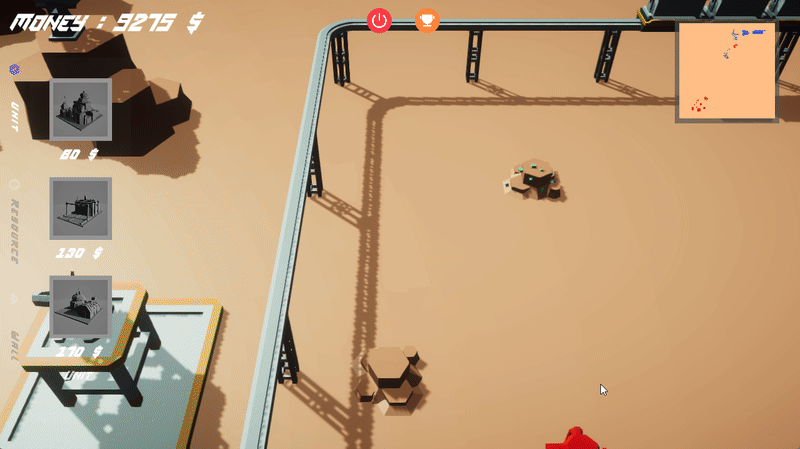

<!-- PROJECT LOGO -->
 

  <h1 align="center">Natchaphon Sirisangsawang's Portfolio</h1>

  

    Natchaphon Sirisangsawang website/portfolio : 
    <a href="https://natchaphon-gamedev.github.io/Portfolio/">Natchaphon React Portfolio || Template by hashirshoaeb✨</a>
     
     
  

## TABLE OF CONTENT
//Test
- [About me 👨‍💻](#about-me-)
- [Education 🎓](#education-)
- [Skill 📖](#skill-)
- [Languages 🔡](#languages-)
- [My Game Showcase 🎮](#my-game-showcase-)

## ABOUT ME 👨‍💻

- ### PERSONAL INFORMATION
  - Name | Natchaphon Sirisangsawang
  - NickName | Pruek (พฤกษ)
  - BirthDate | July 6, 2000
  - Nationality | Thai

- ### MY OBJECTIVE
  - To get more experience and technic in Game Development.
  - To make relationships with other people in the game development community.

- ### STRENGTHS 
  - Fast-Learner 
  - Detail-oriented
  - Collaboration
  - Adaptability
  - Creativity
  - Management
 

- ### ATTITUDE 
  - Passionate about Game Development and Programming.
  - I would love to work with everyone that has the same goal to create the funniest
    game ever!
  - I'm glad to see happiness from people playing games I've developed.

## EDUCATION 🎓

- ### HIGH SCHOOL

    ### Year 2013 - 2019
    - SUANKULARB WITTAYALAI RANGSIT SCHOOL | THAILAND
    Eng - Math 

    * GPA : 3.64

- ### BACHELOR'S DEGREE

    
    ### Year 2019 - 2022
    - BANGKOK UNIVERSITY | THAILAND
    - GAME AND INTERACTIVE MEDIA

    * GPA : 3.97

## SKILL 📖
- #### C# ============ Good                                    
- #### Lua =========== Medium
- #### Java =========== Medium
- #### Firebase ======== Medium
- #### Python ========= Basic
- #### Database SQL ==== Medium
- #### Unity =========== Good
- #### Roblox ========== Medium
- #### Game Design ==== Good
- #### Maya =========== Medium
- #### Multiplayer ==== Medium

## LANGUAGES 🔡
- #### Thai ============ Native
- #### English ========== Good

## MY GAME SHOWCASE 🎮

This is a game that my team and I used to develop during college, Years 1-3.

🏆 => Submit to competition & Won or Enter the final!

<table>
  <tr>
    <td align="center">
    
         
<b> <a href="https://tatiya.itch.io/when" target="_blank"> When </a> </b>   MAIN PROGRAMMER / RIGGER

       
    </td>

 <td align="center">
        <b> When was developed with <a href="https://unity.com/" target="_blank"> Unity </a>    
When is a puzzle game in which you can control time.
Players must solve the puzzle at each stage to acquire an item for time travel. 
🏆 Joined Depa Game Accelerator Program Batch 2, gain a prize Nintendo Switch developer kit and the right to publish the game on the e-shop. 
🏆 Joined GAME TALENT SHOWCASE 2022, finalist of four rewards. 
</b>
    </td>
    </tr>
  <tr>
    <td align="center">
    
 
        <b> <a href="https://tatiya.itch.io/aibo" target="_blank"> AiBō 「あいぼう」 </a> </b>   MAIN PROGRAMMER / SUB LEVEL DESIGN

       
      </a>
       
    </td>

 <td align="center">
        <b> AiBō was developed with <a href="https://unity.com/" target="_blank"> Unity </a>    
AiBō is a two-player game with a concept of two contrasting things compatible with each other.
This game was made in 48 hours for Global Game Jam (GGJ2022)  
🏆1st place on the Global game jam Bangkok(DPU) site.
</b>
    </td>

</tr>
<tr>
    <td align="center">
    
         
        <b> <a href="https://natchaphondev.itch.io/kaid" target="_blank"> KAI Defend (KAID) </a> </b>   MANAGER / MAIN PROGRAMMER / PROJECT DIRECTOR /
GAME DESIGNER
       
    </td>
 <td align="center">
        <b> Kai Defend was developed with 
<a href="https://unity.com/" target="_blank"> Unity </a> and
<a href="https://firebase.google.com/" target="_blank"> FireBase </a>    
Kai Defend is a card tower defense game and based on a mobile platform and use firebase to store the player's score.
</b>
    </td>
  </tr>

  <tr>
    <td align="center">
    
         
        <b> <a href="https://natchaphondev.itch.io/stack-up" target="_blank">STACK UP</a></b>   MANAGER / MAIN PROGRAMMER /
GAME DESIGNER
       
</td>

<td align="center">
        <b> Stack up was developed with 
<a href="https://unity.com/" target="_blank"> Unity </a>, 
<a href="https://natchaphondev.itch.io/stack-up" target="_blank">Oculus integration</a> and
<a href="https://lootlocker.com/?gclid=CjwKCAiAkfucBhBBEiwAFjbkr8oLV9ycfjow3xhMjVwcB8o2cDleDQaY51s23-EKykalW9KPrA9nthoCNz4QAvD_BwE" target="_blank">Loot Locker</a>    
Stack up is a mini game VR and this game is mainly using Oculus Hand Tracking System. 
Players need to clear each mini game task as fast as possible to bring 
their name to the top of the Leaderboard.
</b>
    </td>
  </tr>

  <tr>

  <td align="center">
    
         
        <b> <a href="https://natchaphondev.itch.io/kaid" target="_blank">KAI Defend (KAID)</a></b>   MANAGER / MAIN PROGRAMMER /
GAME DESIGNER
       
</td>

<td align="center">
        <b> Twoarmies was developed with 
<a href="https://unity.com/" target="_blank"> Unity </a>, 
<a href="https://mirror-networking.com/" target="_blank"> Mirror </a>,
<a href="https://steamworks.github.io/" target="_blank"> Steamworks.Net </a> and
<a href="https://lootlocker.com/?gclid=CjwKCAiAkfucBhBBEiwAFjbkr8oLV9ycfjow3xhMjVwcB8o2cDleDQaY51s23-EKykalW9KPrA9nthoCNz4QAvD_BwE" target="_blank">Loot Locker</a>    
Twoarmies is an RTS Multiplayer game that you will be a commander trying to destroy the opponent's base. 
This game is multiplayer with steam account. You can play PVP mode with your friends up to 4 people.  
Command your army and lead them to victory.
their name to the top of the Leaderboard.
</b>
    </td>
  </tr>

  <tr>
<td align="center">
    
         
        <b> <a href="https://natchaphondev.itch.io/zombie-hunter" target="_blank"> Zombie Hunter</a></b>   MANAGER / MAIN PROGRAMMER /
GAME DESIGNER
       
</td>

<td align="center">
        <b> Zombie Hunter was developed with 
<a href="https://unity.com/" target="_blank"> Unity </a>  
Zombie Hunter is an RTS Multiplayer game that you will be a commander trying to destroy the opponent's base. 
This game is multiplayer with steam account. You can play PVP mode with your friends up to 4 people.  
Command your army and lead them to victory.
their name to the top of the Leaderboard.
</b>
    </td>

  </tr>

  <tr>
    <td align="center">
    
      <a href="https://natchaphondev.itch.io/ifitjam2022">
         
        <b> มฤดก (Mridok)   MANAGER / MAIN PROGRAMMER /
GAME DESIGNER</b>
      </a>
       
  </tr>

  <tr>
    <td align="center">
     
      <a href="https://natchaphondev.itch.io/a-taxi">  
         
        <b>A Taxi   MANAGER / MAIN PROGRAMMER /
GAME DESIGNER</b>
      </a>
       
    </td>
</tr>
<tr>
  </tr>
  <tr>
    <td align="center">
    
      <a href="https://natchaphondev.itch.io/time2race">
         
        <b>Time2Race   MANAGER / MAIN PROGRAMMER / PROJECT DIRECTOR /
GAME DESIGNER </b>
      </a>
       
    </td>
    </tr>
  <tr>
    <td align="center">
     
      <a href="https://natchaphondev.itch.io/spaceship">
         
        <b>SpaceShip   SOLO PROJECT</b>
      </a>
       
    </td>
  </tr>
  <tr>
    </tr>

</table>
